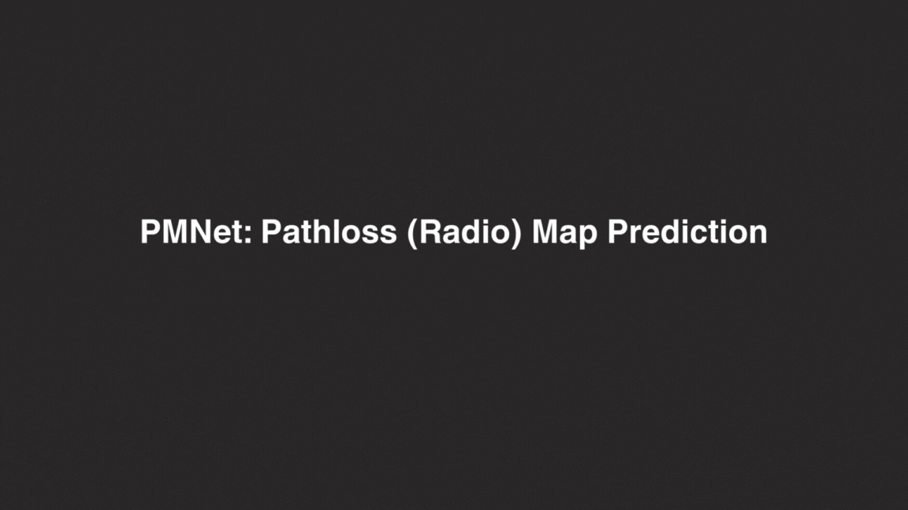
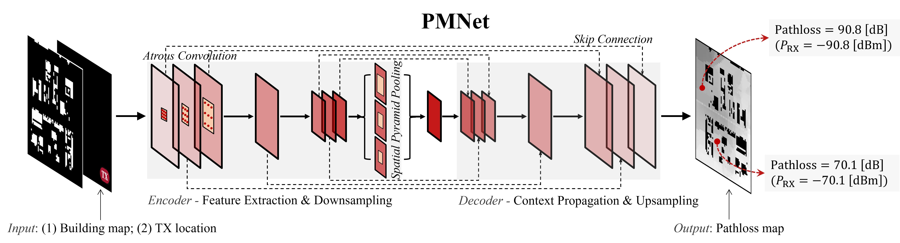
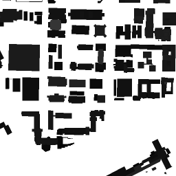
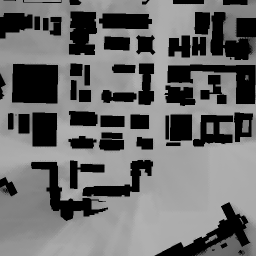

# A Scalable and Generalizable Pathloss Map Prediction

This repo is the implementation of our paper ["A Scalable and Generalizable Pathloss Map Prediction"](https://arxiv.org/abs/2312.03950), as well as the follow-ups.
<div align="center">

</div>

## Highlights
- **PMNet** (NN tailored for Pathloss Map Prediction (PMP)) is described in [arxiv](https://arxiv.org/abs/2103.14030), which serves as a backbone for the PMP task.
- PMNet achieves strong performance on the PMP task ($10^{-2}$ level RMSE on val), surpassing other models by a large margin.
- Proposed a method to predict pathloss in unseen network scenarios using transfer learning (TL) with three pre-trained models: VGG16 and two PMNet models. Our PMNet pre-trained model generalizes well, adapting to new scenarios 5.6× faster and using 4.5× less data, while maintaining high accuracy (RMSE $10^{-2}$ level).
- This repository includes the training/test dataset and pre-trained model/checkpoints.

<!--  -->
<div align="center">

</div>
<!-- ## Main Results on USC RT Dataset with Pretrained Models -->

## Citation

```
@article{lee2024scalable,
    title={A Scalable and Generalizable Pathloss Map Prediction}, 
    author={Ju-Hyung Lee and Andreas F. Molisch},
    year={2024},
    journal={IEEE Transactions on Wireless Communnications (TWC)}
}
```

```
@inproceedings{lee2023pmnet,
    title={PMNet: Robust Pathloss Map Prediction via Supervised Learning},
    author={Ju-Hyung Lee and Omer Gokalp Serbetci and Dheeraj Panneer Selvam and Andreas F. Molisch},
    year={2023},
    month={December},
    booktitle={Proc. of IEEE Global Communicaions Conference (GLOBECOM)},
}
```

## Dataset: Ray-Tracing (RT)-based Channel Measurement

<!-- 


 -->
<div align="center">
  <br/>
 
 
 
</div>

<!-- <div align="center"> -->
| #   | Dataset (Map) | # of samples   | Download Link                                                                                     |
| --- | ------------- | -------------- | ------------------------------------------------------------------------------------------------- |
| 1   | USC           | 4754           | [Download](https://drive.google.com/file/d/1g2VseFCahxqF1_nVqWbp17wmle3aDAmq/view?usp=sharing)    |
| 2   | UCLA          | 3776           | [Download](https://drive.google.com/file/d/14k5uIEAkWp-F1utbJeZqec79LRsBnmoi/view?usp=sharing)    |
| 3   | Boston        | 3143           | [Download](https://drive.google.com/file/d/1utc73Z0jcfBVO6TscPNQrU7tohU02Tab/view?usp=sharing)    |
| 4   | USC-Upgraded  | 8912           | [Download](https://drive.google.com/file/d/1GvD_Q2VgnrQVDOoNED4VIIJUKUaPwDMe/view?usp=sharing)    |
| 5   | Rural         | 328            | [Download](https://drive.google.com/file/d/1jOEup6UiAl7pqlTomuaCnfZJUkX6ZbvD/view?usp=sharing)    |
<!-- </div> -->

<!-- **Download Link** <br/>
[USC Dataset](https://drive.google.com/file/d/1uk7no4GwSCQ_sKI3WWnl67llzV1iLQ4l/view?usp=sharing) <br/>
[Radiomapseer Reduced](https://drive.google.com/file/d/12eeypRCnTaCv1WyY9E-FT7ugvdsBTqDN/view?usp=sharing) <br/>
[Radiomapseer Orginal](https://drive.google.com/file/d/1PTaPpLOKraVCRZU_Tzev4D5ZO32tpqMO/view?usp=sharing) -->

## Available checkpoints for PMNet

| #   | Feature Size | Data-Augmentation | Fine-Tuning    | RMSE     | Download Link                                                                                     |
| --- | ------------ | ----------------- | -------------- | -------- | ------------------------------------------------------------------------------------------------- |
| 1   | 16/H X 16/W  | 4-way rotation    | -              | 0.012599 | [Download](https://drive.google.com/file/d/1r1k9_PgqJEitY1E0VYZ62e2btuGwgnFk/view?usp=sharing)    |
| 2   | 8/H X 8/W    | 4-way rotation    | -              | 0.010570 | [Download](https://drive.google.com/file/d/1cAPSHiM-Q9JPnT1e-cP6u6ppXgCRKPTy/view?usp=sharing)    |
| 3   | 16/H X 16/W  | -                 | UCLA Dataset   | 0.031449 | [Download](https://drive.google.com/file/d/1xshE4Y2Qa4k1ir1kzS2MAdDidJ6oVLGc/view?usp=sharing)    |
| 4   | 16/H X 16/W  | -                 | Boston Dataset | 0.009875 | [Download](https://drive.google.com/file/d/17G-F19Bw05gyFcTbc9MYqrxYlzs0YP5K/view?usp=sharing)    |
| 5   | 8/H X 8/W    | 4-way rotation    | -              | 0.008944 | [Download](https://drive.google.com/file/d/1WuIMh5eBmMbUmVqLYB3bPi_mO1_G0wUv/view?usp=sharing)    |

- #3,4 checkpoints were fine-tuned using (1), a pre-trained model with USC Dataset.
- #5 was trained on USC-Upgraded dataset.

## Train

To train PMNet, please refer to train.sh

```bash
python train.py -d [dataset-root] -n [network-type] -c [config-class-name]
# e.g., python train.py -d '/USC/' -n 'pmnet_v3' -c 'config_USC_pmnetV3_V2'
```

## Evaluation

To evaluate above models, refer to the following commands. Or, you can run eval.sh

```bash
python eval.py \
    --data_root [dataset-directory] \
    --network [network-type] \ # pmnet_v1 or pmnet_v3
    --model_to_eval [model-to-eval] \
    --config [config-class-name]
# e.g.,
# python eval.py \
#    --data_root '/USC/' \
#    --network 'pmnet_v3' \
#    --model_to_eval 'config_USC_pmnetV3_V2_epoch30/16_0.0001_0.5_10/model_0.00012.pt' \
#    --config 'config_USC_pmnetV3_V2'
```


