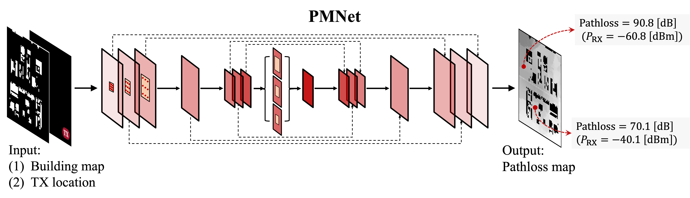
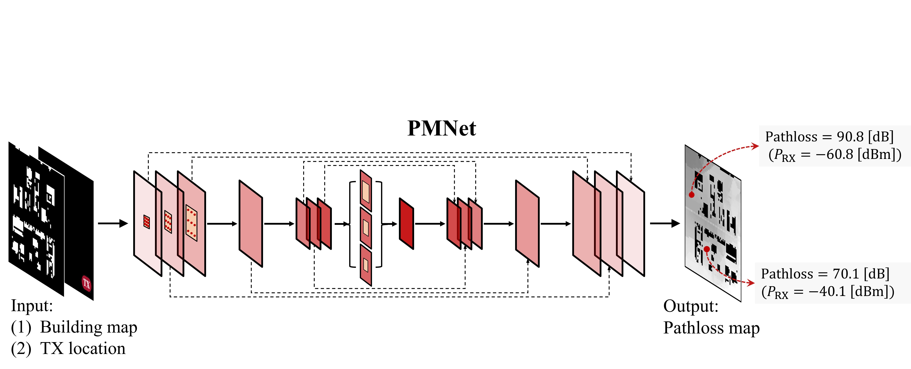
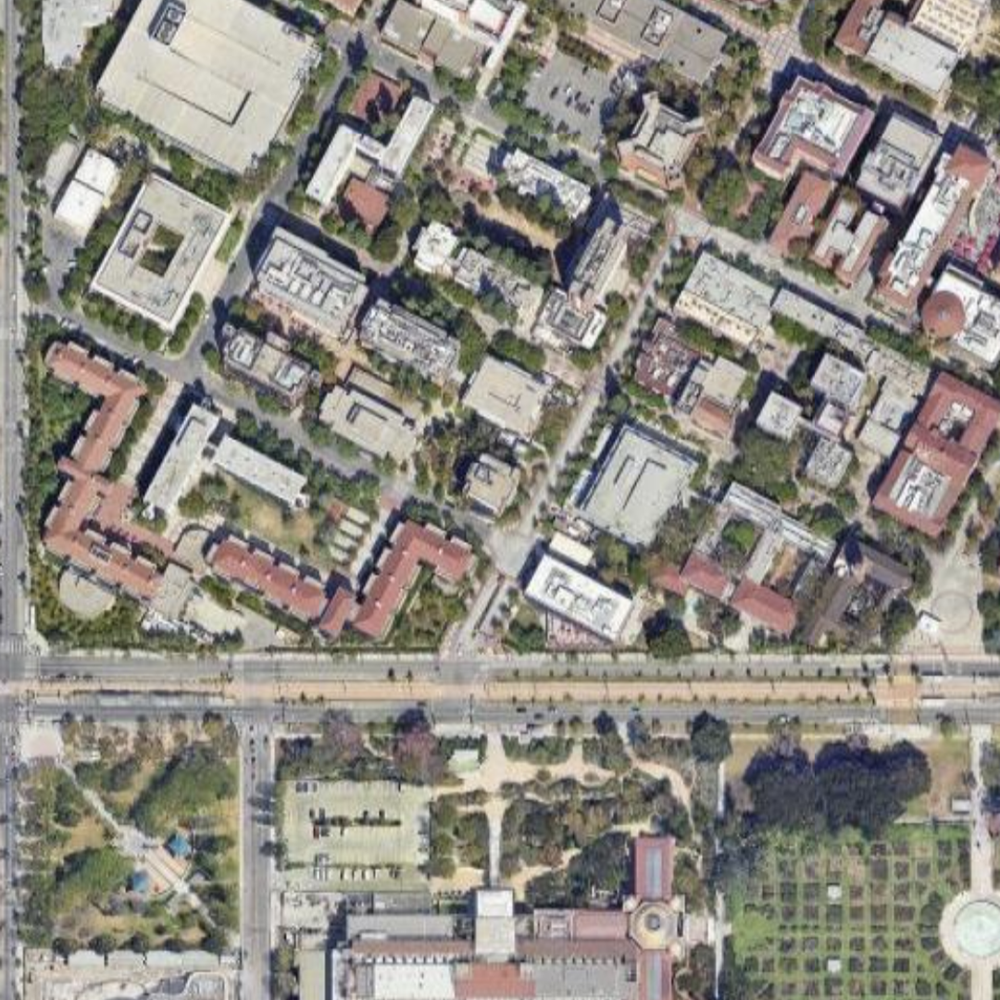
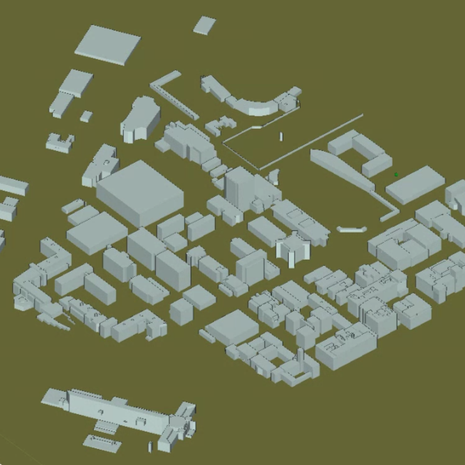
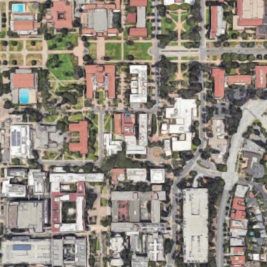
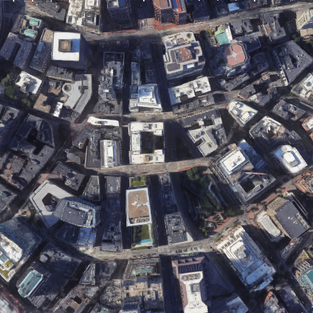

# A Scalable and Generalizable Pathloss Map Prediction

This repo is the official implementation of ["A Scalable and Generalizable Pathloss Map Prediction"](https://arxiv.org/abs/2211.10527.pdf) as well as the follow-ups.

## Introduction

**PMNet** (Neural network tailored for Pathloss Map Prediction (PMP)) is described in [arxiv](https://arxiv.org/abs/2103.14030), which capably serves as a backbone for the PMP task. 

PMNet achieves strong performance on the PMP task (`$10^{-2}$` level RMSE on val), surpassing previous models by a large margin.

<!--  -->



<!-- ## Main Results on USC RT Dataset with Pretrained Models -->


## Dataset: Ray-Tracing (RT)-based Channel Measurement  (Updating...)

<!-- 


 -->
  <br/>
 


**Links for Dataset** <br/>
[USC Dataset](https://drive.google.com/file/d/1uk7no4GwSCQ_sKI3WWnl67llzV1iLQ4l/view?usp=sharing) <br/>
[Radiomapseer Reduced](https://drive.google.com/file/d/12eeypRCnTaCv1WyY9E-FT7ugvdsBTqDN/view?usp=sharing) <br/>
[Radiomapseer Orginal](https://drive.google.com/file/d/1PTaPpLOKraVCRZU_Tzev4D5ZO32tpqMO/view?usp=sharing)


## Citation

```
@inproceedings{lee2023pmnet,
      title={PMNet: Robust Pathloss Map Prediction via Supervised Learning}, 
      author={Ju-Hyung Lee and Omer Gokalp Serbetci and Dheeraj Panneer Selvam and Andreas F. Molisch},
      year={2023},
      month={December},
      booktitle={Proceedings of IEEE Global Communicaions Conference (GLOBECOM)},
}
```